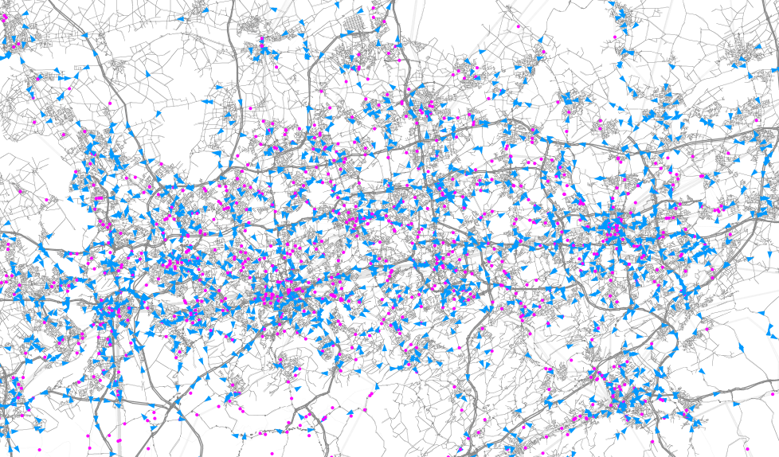

# The MATSim Open Ruhrgebiet Scenario

### About this project

This repository provides an open MATSim transport model for Ruhrgebiet (Ruhr area, Germany), generated by the [Transport Systems Planning and Transport Telematics group](https://www.vsp.tu-berlin.de) of [Technische Universität Berlin](http://www.tu-berlin.de).

Currently, there is only a 1pct version of the MATSim Open Ruhrgebiet model. The model contains a 1pct sample of the Ruhrgebiet population; road capacities are accordingly reduced. The scenario is calibrated taking into consideration the traffic counts, modal split and mode-specific trip distance distributions.

### Note

Handling of large files within git is not without problems (git lfs files are not included in the zip download; we have to pay; ...).  In consequence, large files, both on the input and on the output side, reside at https://svn.vsp.tu-berlin.de/repos/public-svn/matsim/scenarios/countries/de/ruhrgebiet .  

### Simple things (without installing/running MATSim)

##### Movies

1. Go to https://svn.vsp.tu-berlin.de/repos/public-svn/matsim/movies/ruhrgebiet_nemo/.
1. Inside there, look for movie files.  You can't view them directly, but you there are various ways to download them, and you can view them then.  Try that.

##### Run VIA on output files

1. Get VIA from https://www.simunto.com/via/.  (There is a free license for a small number of agents; that will probably work but only display a small number of vehicles/agents.)
1. Go to https://svn.vsp.tu-berlin.de/repos/public-svn/matsim/scenarios/countries/de/ruhrgebiet/.
1. Inside there, look for an `output-*` directory that you find interesting and go into that directory.
1. Download `*.output_network.xml.gz` and `*.output_events.xml.gz`.  Best make sure that they do not uncompress, e.g. by "Download linked file as ...".
1. Get these files into VIA.  This can be achieved in various ways; one is to open VIA and then drag the files from a file browser into VIA.
1. Run VIA and enjoy.

### Downloading the repository alternative 1: Download ZIP

1. Click on `Clone or download` and then on `Download ZIP`.
1. Unzip the repository.
1. Go to "Run the MATSim Ruhrgebiet scenario" below.

### Downloading the repository alternative 2: Clone the repository

##### Initial stuff (needs to be done once)

1. Install git for the command line.
1. Type `git clone https://github.com/matsim-vsp/matsim-ruhrgebiet.git` in the command line.

(Or use your IDE, e.g. Eclipse, IntelliJ, to clone the repository.)

This will result in a new `matsim-ruhrgebiet` directory.  Memorize where you have put it.  You can move it, as a whole, to some other place.

##### Update your local clone of the repository.

1. Go into the `matsim-ruhrgebiet` directory.
1. Type `git pull`

(Or use your IDE, e.g. Eclipse, IntelliJ, to update the repository.)

This will update your repository to the newest version.

### Run the scenario
(Requires either cloning or downloading the repository.)

##### ... using a runnable jar file (available once we have a first release)
1. There should be a file directly in the `matsim-ruhrgebiet` directory with name approximately as `matsim-ruhrgebiet-1.0-jar-with-dependencies.jar`.
1. Double-click on that file (in a file system browser).  A simple GUI should open.
1. In the GUI, click on the "Choose" button for configuration file.  Navigate to one of the `scenario` directories and load one of the configuration files.
1. Increase memory in the GUI.
1. Press the "Start MATSim" button.  This should run MATSim.  Note that MATSim accepts URLs as filenames in its config, so while the config files are part of the git repo, running them will pull additional material from our server.
1. "Open" the output directory.  You can drag files into VIA as was already done above.
1. "Edit..." (in the GUI) the config file.  Re-run MATSim.

##### ... using an IDE, e.g. Eclipse, IntelliJ
1. Set up the project in your IDE.
1. Make sure the project is configured as maven project.
1. Run the JAVA class `src/main/java/org/matsim/run/RunRuhrgebietScenario.java` or `src/main/java/org/matsim/gui/MATSimGUI.java`.
1. "Open" the output directory.  You can drag files into VIA as was already done above.
1. Edit the config file or adjust the run class. Re-run MATSim.

### More information

For more information about the scenario generation, see here: https://svn.vsp.tu-berlin.de/repos/public-svn/publications/vspwp/2018/18-08/. For more information about MATSim, see here: https://www.matsim.org/.

### Acknowledgements

The generation of the MATSim Open Ruhrgebiet Scenario was made possible by Stiftung Mercator (https://www.stiftung-mercator.de/) within the project Neue Emscher Mobilität (NEMO, https://www.nemo-ruhr.de).
